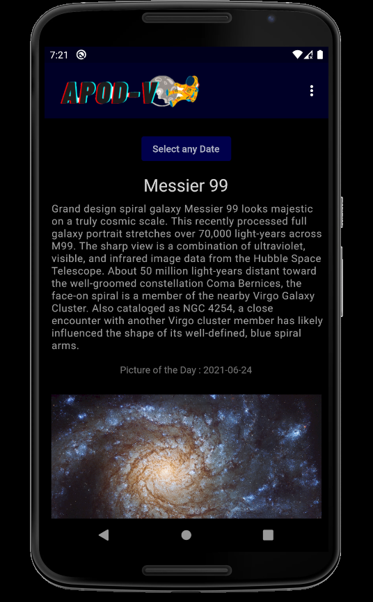
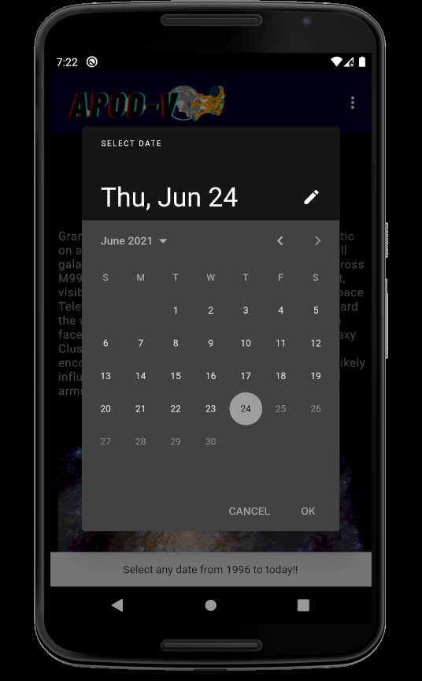

# Astronomy Picture of the Day (APOD-V)

A  flutter app to display Astronomy picture of the day by getting the data from NASA API.


## Features

- Gets you todays Astronomy Picture of the day from NASA.
<div style="display:inline">

</div>

- You can search for picture of particular day from 1996 to today.
<div style="display:inline">

</div><br>

- Youtube links of picture of day can also be played within app.
<div style="display:inline">


</div><br>

- You can use the search 2000 times in an hour.Counter resets back again to 2000 requests after an hour.You can check how many requests are remaining for this hour.
<div style="display:inline">


</div>

## More pictures of Weather App

<div style="display:inline">


</div>
<div style="display:inline">


</div>
<div style="display:inline">


</div>

## Note for cloning

Create a file called `secrets.dart` in `/utilities` folder.
```dart
const API_KEY='asjahsjhalksjakjska';//your API key here 
```

Get your API key from [NASA APOD API.](https://api.nasa.gov/)

## Queries

If you have any queries contact me [Vishal Rajkumar Naik.](mailto:vishalrajkumar13232@gmail.com)

